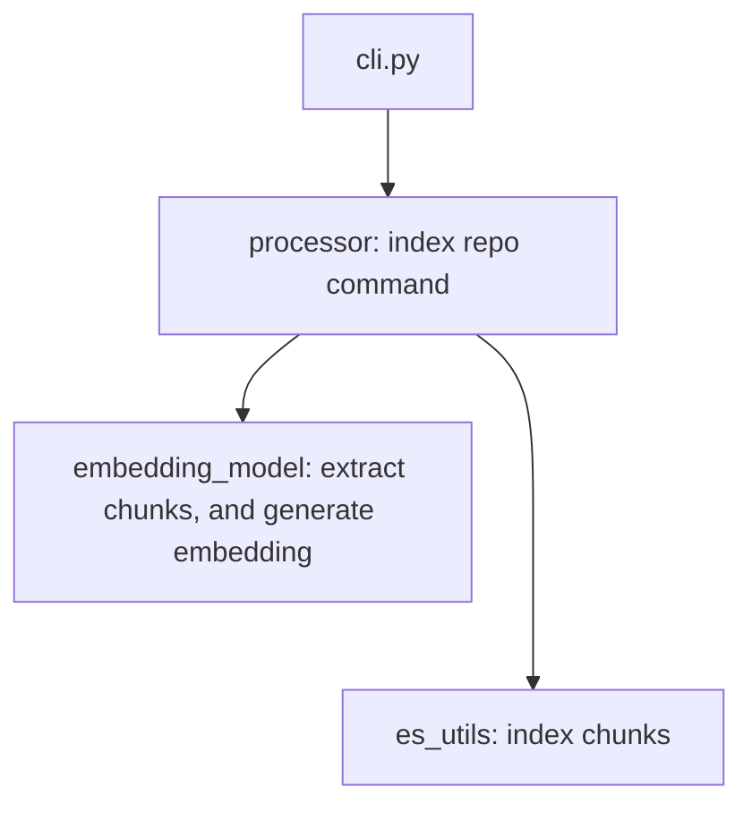
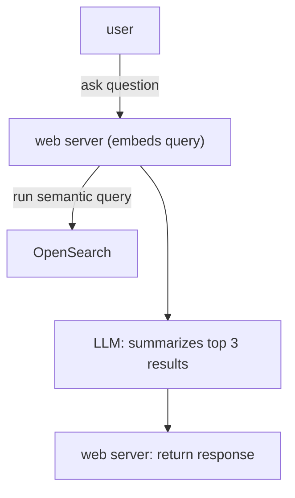

# Repo Embedding
The main idea of this project is clone a Python repository, and index it. The two methods used are: parse the code as an Abtract Syntax Tree and embed the code chunks using HuggingFace's SentenceTransformers. The embeddings and their chunks are then stored in an Elasticsearch index.

## Architecture

The main components of the project are:

- `cli.py`: The main entry point of the application. It provides a CLI interface to index a repository.
- `processor.py`: The processor module is responsible for processing the repository. It clones the repository, extracts the code chunks, and embeds them.
- `es_utils.py`: The Elasticsearch utilities module is responsible for interacting with the Elasticsearch index. It provides functions to ensure the index exists, index the chunks, and search the index.
- `embedding_model.py`: The embedding model module is responsible for embedding the code chunks. It uses HuggingFace's SentenceTransformers to embed the code chunks.

The indexer workflow is as follows:


The server architecture is as follows:


## Setup

### Using Conda (Recommended)

1. Create and activate the conda environment:
```bash
conda env create -f environment.yml
conda activate repo-indexer
```

2. Verify the environment is set up correctly:
```bash
python -c "import fastapi, typer, sentence_transformers, elasticsearch; print('All dependencies installed successfully!')"
```

### Using pip (Alternative)

If you prefer to use pip directly:
```bash
pip install -r requirements.txt
```

### Development Environment

For development with additional tools (pytest, black, flake8, mypy):
```bash
conda env create -f environment-dev.yml
conda activate repo-indexer-dev
```

## Usage

```bash
python -m cli index_repo <github_url>
```

Visit:
```
http://localhost:8000/summarizer/streaming-ui?q=make%20a%20post%20request
```


# TODO:
[ ] Host embedding model separately
[ ] Handle ElasticSearch and OpenSearch?
